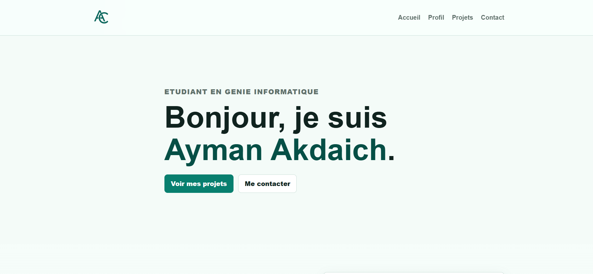
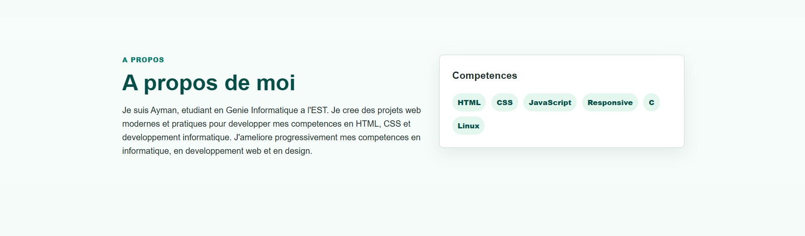
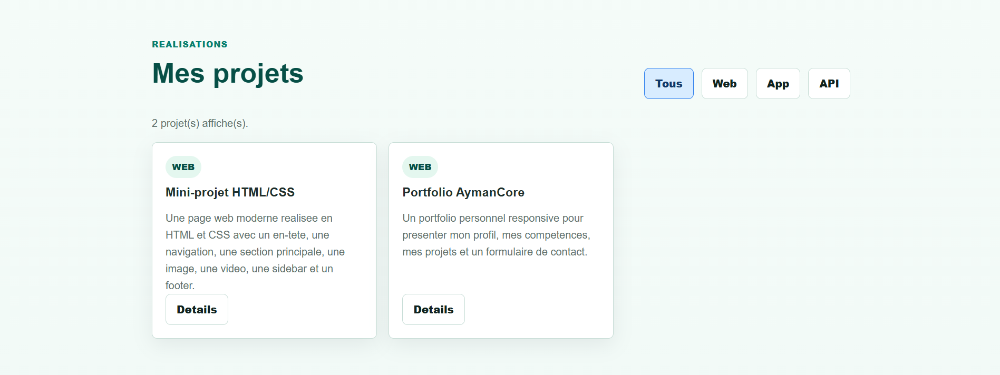
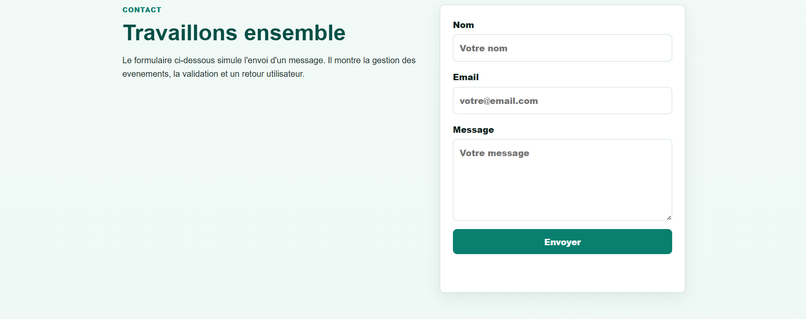

# AymanCore Portfolio

## Description

AymanCore Portfolio est un portfolio personnel realise en HTML, CSS et JavaScript.
Il presente mon profil, mes competences, mes projets et un formulaire de contact.

Ce projet a ete cree dans le cadre du projet final de JavaScript avance. L'objectif
est de construire une application web personnelle, responsive et interactive.

## Fonctionnalites

- Navigation responsive avec menu mobile
- Section d'accueil personnalisee
- Presentation du profil et des competences
- Affichage dynamique des projets
- Filtres de projets
- Fenetre de details pour chaque projet
- Formulaire de contact avec validation simple
- Chargement des donnees avec `fetch` et `async/await`

## Technologies utilisees

- HTML
- CSS
- JavaScript
- JSON
- GitHub

## Structure du projet

```text
projet/
+-- index.html
+-- styles.css
+-- script.js
+-- projects.json
+-- logo-ac.png
+-- screenshots/
+-- README.md
```

## Maquette Figma

Lien de la maquette Figma :

```text
https://www.figma.com/design/XxuJU99sCZ1OQ2HTNuaJjN?node-id=13-3
```

## Captures d'ecran

Page d'accueil :



Section a propos :



Section realisations :



Section contact :



## Lien du site en ligne

Lien GitHub Pages :

```text
https://aymancore.github.io/
```

## Auteur

Ayman Akdaich  
Etudiant en Genie Informatique a l'EST
